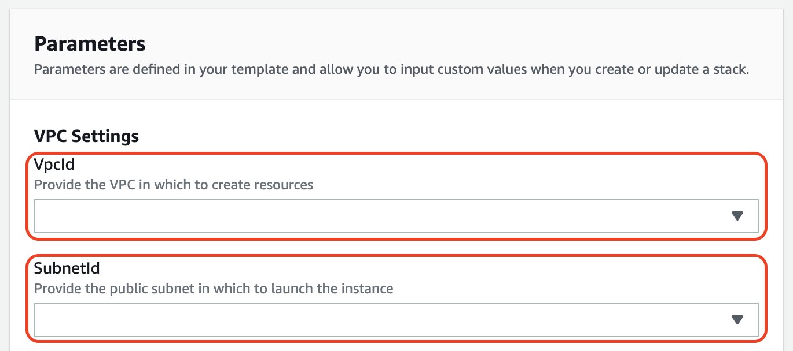
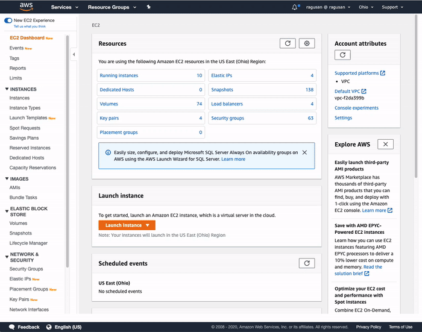
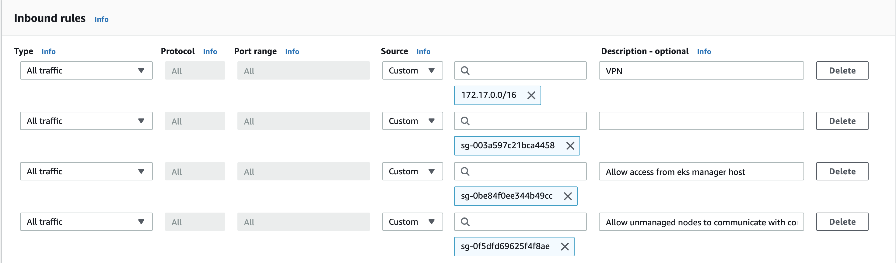
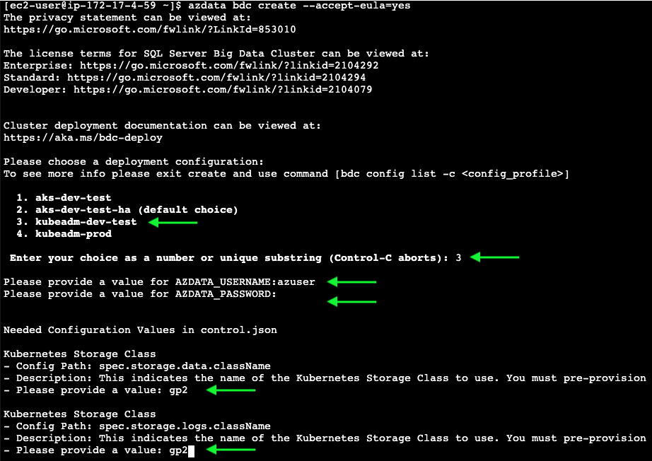

## Overview

The following CloudFormation template has been built to help simplify the deployment of Microsoft SQL Server 2019 Big Data Cluster on AWS. Once deployed, this template will create:
* An EC2 instance with the following:
  * The `azdata` tool installed for managing the Big Data Cluster
  * `eksctl` to create an EKS cluster on AWS
  * An instance profile attached to the instance so you can use the tools above

 
### Deploy Stack

The first step is to deploy a stack using the provided CloudFormation template. Click the appropriate button below to launch in your prefered region:

| Region    | Stack                                                                                                                                                                                                                                                                                               |
|-----------|-----------------------------------------------------------------------------------------------------------------------------------------------------------------------------------------------------------------------------------------------------------------------------------------------------|
| us-east-1 | [](https://console.aws.amazon.com/cloudformation/home?region=us-east-1#/stacks/new?stackName=eks-manager&templateURL=https://ragusan-cloudformation.s3.amazonaws.com/eks-manager.yml) |
| us-east-2 | [](https://console.aws.amazon.com/cloudformation/home?region=us-east-2#/stacks/new?stackName=eks-manager&templateURL=https://ragusan-cloudformation.s3.amazonaws.com/eks-manager.yml) |


There are 2 parameters that must be filled in that are specific to your environment:



The remaining parameters have suitable defaults.

### Connect to the Instance

To connect to the EC2 instance, use [Systems Manager Session Manager](https://docs.aws.amazon.com/systems-manager/latest/userguide/session-manager.html).



In your AWS account:
1) Go to the EC2 console and find the instance named `eks-manager` (or the whatever instance name you gave it) 
2) Click the __Connect__ button at the top
3) Select the __Session Manager__ radio button
4) Click the blue __Connect__ button

### Create EKS Cluster

There is a tool installed on the EC2 instance called `eksctl` which will be used to create an EKS cluster. 

Now we can use the output from above when we create our EKS cluster:
```
eksctl create cluster \
    --name bdc \
    --region us-east-1 \
    --tags "Environment=Dev,Project=BigDataCluster,Name=bdc-node" \
    --version 1.15 \
    --nodes 3 \
    --node-type m5.large \
    --nodegroup-name workers \
    --node-volume-size 100 \
    --vpc-public-subnets=subnet-XXXXXX,subnet-XXXXXX,subnet-XXXXXX \
    --vpc-private-subnets=subnet-XXXXXX,subnet-XXXXXX,subnet-XXXXXX \
    --managed
```

Be sure to replace `vpc-public-subnets` and `vpc-private-subnets` with values from your environment!

This process can take 30 or more minutes to complete. You can check the progress of the command by logging in to the CloudFormation console and checking on the stack deployment progress.

### Allow Access to Pods

You'll want to add the security group of this instance to the security group of the nodegroup. 
1) Go to the EC2 console and select any one of the nodes (should be named `bdc-node`)
2) Click on the security group. It should be named something like `eks-cluster-bdc-sg-XXXX`.
3) Add a new inbound rule to allow *All traffic* from the security group of the EKS manager instance.



### Launch a Big Data Cluster

Once the cluster is up and running, you can now deploy Microsoft SQL Server 2019 Big Data Cluster using the pre-installed `azdata` tool. An example command:

```
azdata bdc create --accept-eula=yes
```


As the Big Data cluster is deployed, it will output the IP for the cluster endpoint. You'll need this for connecting to the cluster, so make sure you leave this window open!